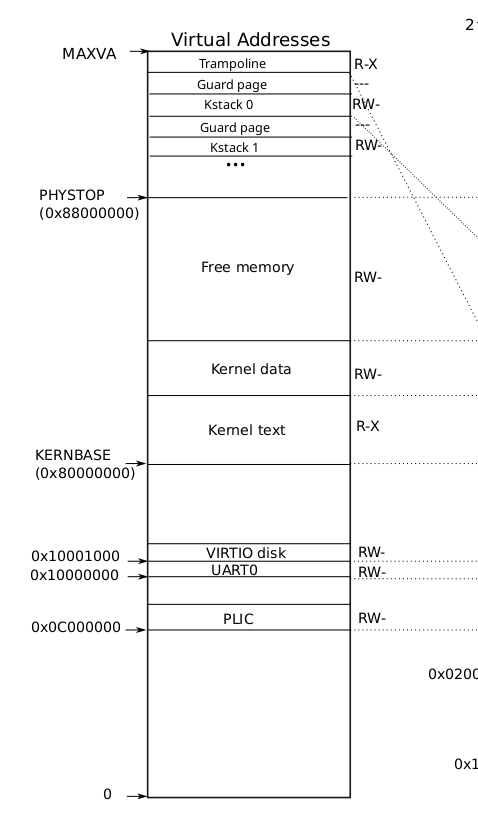

# Answer - Syscall 
## answer: gdb
1. Looking at the backtrace output, which function called syscall?
- ans: kernel/trap.c的usertrap()。
```
(gdb) backtrace
#0  syscall () at kernel/syscall.c:133
#1  0x0000000080001aa6 in usertrap () at kernel/trap.c:68
#2  0x0000003ffffff09c in ?? ()

```

2. What is the value of p->trapframe->a7 and what does that value represent? (Hint: look at user/init.c, the first user program xv6 starts, and its compiled assembly user/init.asm.)
- ans: p->trapframe->a7 存放syscall的編號，也就是user space所呼叫的syscall是什麼， kernel就會把對應的syscall number填到這個register/變數裡。這符合riscv的call convention設計。
```
(gdb) p /x *p
$1 = {lock = {locked = 0x0, name = 0x80007130, cpu = 0x0}, state = 0x4, 
  chan = 0x0, killed = 0x0, xstate = 0x0, pid = 0x1, parent = 0x0, 
  kstack = 0x3fffffd000, sz = 0x4000, pagetable = 0x87f52000, 
  trapframe = 0x87f56000, context = {ra = 0x80001306, sp = 0x3fffffddf0, 
    s0 = 0x3fffffde20, s1 = 0x8000a630, s2 = 0x8000a200, s3 = 0x0, 
    s4 = 0x0, s5 = 0x0, s6 = 0x0, s7 = 0x0, s8 = 0x0, s9 = 0x0, s10 = 0x0, 
    s11 = 0x0}, ofile = {0x8001a330, 0x8001a330, 0x0 <repeats 14 times>}, 
  cwd = 0x80018740, name = {0x69, 0x6e, 0x69, 0x74, 0x0 <repeats 12 times>}}


(gdb) p /x *p->trapframe
$2 = {kernel_satp = 0x8000000000087fff, kernel_sp = 0x3fffffe000, kernel_trap = 0x800019f8, 
  epc = 0x3d0, kernel_hartid = 0x2, ra = 0x2a, sp = 0x3fb0, gp = 0x0, tp = 0x0, t0 = 0x0, 
  t1 = 0x0, t2 = 0x0, s0 = 0x3fd0, s1 = 0x0, a0 = 0x0, a1 = 0x2, a2 = 0x0, a3 = 0x0, 
  a4 = 0x0, a5 = 0x0, a6 = 0x0, a7 = 0xa, s2 = 0x0, s3 = 0x0, s4 = 0x0, s5 = 0x0, s6 = 0x0, 
  s7 = 0x0, s8 = 0x0, s9 = 0x0, s10 = 0x0, s11 = 0x0, t3 = 0x0, t4 = 0x0, t5 = 0x0, t6 = 0x0}
```

3. What was the previous mode that the CPU was in?
- ans: 這題要看SPP flag(bit 8)，對應的bit = 0，所以推論在進kernel之前是user mode。
```
(gdb) p /x $sstatus
$3 = 0x200000022

```
```
SPP:The SPP bit indicates the privilege level at which a hart was executing before entering supervisor
mode. When a trap is taken, SPP is set to 0 if the trap originated from user mode, or 1 otherwise.

SIE: The SIE bit enables or disables all interrupts in supervisor mode. When SIE is clear, interrupts are
not taken while in supervisor mode. When the hart is running in user-mode, the value in SIE is
ignored, and supervisor-level interrupts are enabled. The supervisor can disable indivdual interrupt
sources using the sie register.
```
- 延伸問題: 將syscall.c 的num = p->trapframe->a7; 改成 num = * (int *) 0;
這時候再去看sstatus就會是0x200000120。

4. Write down the assembly instruction the kernel is panicing at. Which register corresponds to the variable num?
- ans: 承上題延伸，這個code對應的指令是 `lw    a3, 0(zero)`，反推得知`num`放在`a3 register`裡面。

5. Why does the kernel crash? Hint: look at figure 3-3 in the text; is address 0 mapped in the kernel address space? Is that confirmed by the value in scause above? (See description of scause in RISC-V privileged instructions)
- ans:直接從圖去看，kernel VA的映射也沒有addr=0，那自然會遇到page fault的問題（因為該記憶體分頁未被配置）。如何證實？`Load Page Fault (scause: 13 / 0xd)`panice資訊就可以推知了。


6. What is the name of the process that was running when the kernel paniced? What is its process id (pid)?
- ans: 看上面的`(gdb) p /x *p `輸出
```

// 重點：
name = {0x69, 0x6e, 0x69, 0x74, 0x0 <repeats 12 times>}}
解析字串就是 Init，所以這題答案是Init

```
## HELPER
gdb command: 
```
target remote localhost:25000 # connect to gdb host
file kernel/kernel # capture execution file

layout src # 取得與真實C程式碼的對應表
```

vscode 快速環境配置:
1. C/C++ (Microsoft): 提供語法高亮與調試支持。
2. Clangd (推薦): 比官方 C/C++ 插件更強大的代碼跳轉與自動補全。
- 註：若使用 Clangd，建議禁用 C/C++ 插件的 IntelliSense 功能以避免衝突。
3. 代碼跳轉配置 (IntelliSense)
xv6 包含很多硬件底層宏定義，為了讓 VS Code 正確識別跳轉，最推薦的方法是生成 compile_commands.json。
- 安裝 Bear：sudo apt install bear
- 在 xv6 目錄執行：make clean && bear -- make qemu
- 根目錄會生成 compile_commands.json，VS Code 的 Clangd 插件會自動讀取它。